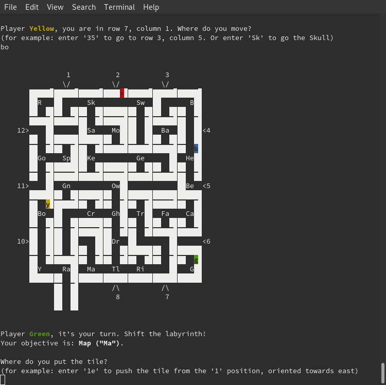

# The Labyrinth board game

A Rust implementation of the classic [Labyrinth board game](https://en.wikipedia.org/wiki/Labyrinth_(board_game)) in less than 1000 lines of code, for educational purposes.

The game can be played (clumsily) in a terminal and looks like this:

It includes a basic state analyzer that gives hints about the reachability of players' objectives, looking one or two moves ahead.

## Usage

Simply run `cargo run --release` and follow the instructions. Enjoy!
